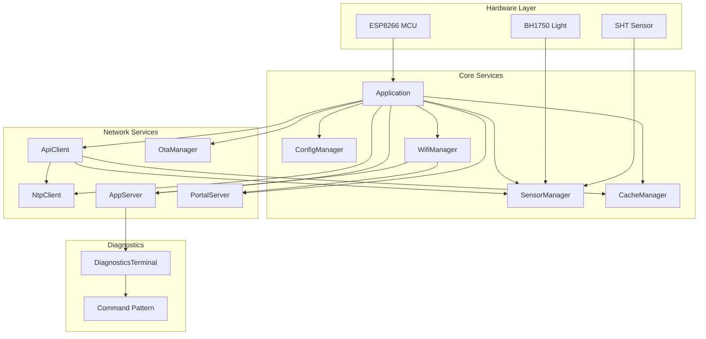

# Greenhouse Node Firmware

[](https://app.codacy.com?utm_source=gh&utm_medium=referral&utm_content=&utm_campaign=Badge_grade)
[](https://github.com/DhimasArdinata/node-medini/actions)
[](https://node-medini.netlify.app/)
[](https://opensource.org/licenses/MIT)

Firmware untuk node sensor monitoring greenhouse berbasis ESP8266 (Wemos D1 Mini / NodeMCU). Proyek ini dirancang untuk keandalan, keamanan, dan pemeliharaan jangka panjang, dengan fokus pada praktik rekayasa perangkat lunak modern untuk sistem embedded.

---

## Daftar Isi

- [Fitur Utama](#fitur-utama)
- [Perangkat Keras yang Didukung](#perangkat-keras-yang-didukung)
- [Struktur Proyek](#struktur-proyek)
- [Pengaturan & Penggunaan](#pengaturan--penggunaan)
  - [Prasyarat](#prasyarat)
  - [Instalasi](#instalasi)
  - [Konfigurasi](#konfigurasi)
  - [Membangun & Mengunggah](#membangun--mengunggah)
- [Akses Perangkat](#akses-perangkat)
- [Pengembangan](#pengembangan)
  - [Menjalankan Unit Tests](#menjalankan-unit-tests)
- [Lisensi](#lisensi)

---

## Fitur Utama

- **Konektivitas Tangguh**:
  - **Captive Portal**: Konfigurasi WiFi yang mudah saat pertama kali dijalankan atau saat koneksi gagal.
  - **Koneksi Ulang Otomatis**: Secara cerdas mencoba menyambung kembali ke WiFi dan melakukan *reboot* jika terlalu lama terputus dari jaringan.
  - **mDNS**: Akses perangkat di jaringan lokal dengan nama yang mudah diingat (contoh: `gh-1-node-4.local`).

- **Manajemen Data Andal**:
  - **Caching Store-and-Forward**: Mampu menyimpan data sensor secara offline hingga **~5 hari** jika server tidak dapat dijangkau (berdasarkan interval pengiriman 10 menit). Data secara otomatis dikirim saat koneksi pulih.
  - **Integritas Data**: Setiap record data di cache dilindungi oleh **CRC32** untuk mencegah pengiriman data yang rusak (korup) akibat masalah pada filesystem.

- **Manajemen Jarak Jauh & Diagnostik**:
  - **Terminal Diagnostik Berbasis WebSocket**: Akses antarmuka baris perintah (CLI) real-time melalui browser untuk status, konfigurasi, dan debugging.
  - **Pembaruan Firmware Over-The-Air (OTA)**:
    - **API-based (HTTPS)**: Perangkat secara otomatis memeriksa dan mengunduh firmware baru dari server secara berkala, memastikan keamanan melalui koneksi terenkripsi.
    - **Web-based**: Unggah file `.bin` secara manual melalui halaman web yang dilindungi kata sandi.
    - **PlatformIO OTA**: Dukungan untuk pembaruan OTA langsung dari lingkungan pengembangan.

- **Kualitas & Keamanan Kode**:
  - **Standar Kode Ketat**: Dikompilasi dengan flag peringatan dan analisis statis yang agresif (`-Wall`, `-Wextra`, `-Werror`, `-Weffc++`) untuk memastikan kualitas kode setara produksi.
  - **Keamanan Memori**: Menggunakan flag compiler modern seperti `-fstack-protector-strong`, `-fstack-clash-protection`, dan `-D_FORTIFY_SOURCE=2` untuk mengeraskan firmware terhadap kerentanan umum seperti *stack smashing* dan *buffer overflows*.
  - **Build Terisolasi**: Peringatan dari *library* pihak ketiga secara otomatis disembunyikan, memungkinkan `-Werror` diterapkan secara ketat hanya pada kode inti proyek.

- **Praktik Pengembangan Modern**:
  - **Pengujian Otomatis (CI)**: Setiap *commit* dan *pull request* secara otomatis diuji kompilasinya untuk berbagai target papan menggunakan GitHub Actions.
  - **Dokumentasi Otomatis**: Dokumentasi kode dihasilkan secara otomatis dari komentar sumber menggunakan Doxygen dan di-deploy ke Netlify.
  - **Unit Testing**: Fungsionalitas inti seperti manajemen cache dan logika watchdog diverifikasi melalui unit test yang dapat dijalankan langsung di perangkat keras.

## Perangkat Keras yang Didukung

- Wemos D1 Mini
- NodeMCU v2 (ESP-12E Module)
- Sensor Suhu & Kelembaban: **Sensirion SHT-series** (terhubung via I2C)
- Sensor Cahaya: **BH1750** (terhubung via I2C)

## Struktur Proyek

```
.
├── data/              # File-file web (HTML, CSS) untuk Captive Portal & Web UI
├── docs/              # Output dokumentasi Doxygen (dihasilkan otomatis)
├── include/           # Header file utama untuk aplikasi
├── lib/               # Pustaka kustom (GreenhouseCommon) yang berisi logika inti
├── scripts/           # Skrip Python untuk otomatisasi build (konversi web, flag)
├── src/               # Kode sumber utama aplikasi (main.cpp, Application.cpp)
├── test/              # Unit tests untuk PlatformIO
├── .github/workflows/ # Alur kerja CI/CD untuk GitHub Actions
├── Doxyfile           # Konfigurasi Doxygen
└── platformio.ini     # File konfigurasi utama PlatformIO
```

## Arsitektur Sistem



## Pengaturan & Penggunaan

### Prasyarat

- [Visual Studio Code](https://code.visualstudio.com/)
- [Ekstensi PlatformIO IDE](https://platformio.org/platformio-ide)
- Git

### Instalasi

1. Clone repository ini:

    ```bash
    git clone https://github.com/DhimasArdinata/node-medini.git
    cd node-medini
    ```

2. Buka folder proyek di VS Code. Saat pertama kali dibuka atau saat build pertama dijalankan, PlatformIO akan secara otomatis mengunduh toolchain dan semua library yang diperlukan.

### Konfigurasi

- **ID Perangkat**: Ubah `gh_id` dan `node_id` di bagian `[node_config]` pada file `platformio.ini` untuk setiap perangkat fisik yang unik.
- **Kalibrasi**: Nilai kalibrasi default per-node didefinisikan di `lib/GreenhouseCommon/calibration.h`. Nilai ini dapat diubah saat runtime melalui terminal diagnostik.

### Membangun & Mengunggah

Gunakan antarmuka PlatformIO IDE di VS Code (sidebar kiri) atau jalankan perintah di terminal terintegrasi VS Code.

- **Build Rilis (default):**

    ```bash
    # Ganti 'wemos_d1_mini_usb_release' dengan environment target Anda
    pio run -e wemosd1mini_usb
    ```

- **Unggah Firmware via USB:**

    ```bash
    pio run -e wemosd1mini_usb --target upload
    ```

- **Membuka Serial Monitor:**

    ```bash
    pio device monitor
    ```

- **Unggah Firmware via OTA (Jaringan):**

    ```bash
    # Pastikan perangkat terhubung ke WiFi yang sama
    pio run -e wemosd1mini_ota --target upload
    ```

## Akses Perangkat

Setelah perangkat terhubung ke WiFi, Anda dapat mengaksesnya melalui:

1. **Alamat IP**: Lihat di Serial Monitor saat startup.
2. **mDNS**: Buka `http://gh-${node_config.gh_id}-node-${node_config.node_id}.local` di browser Anda (misalnya, `http://gh-1-node-4.local`).

Halaman web akan menampilkan terminal diagnostik real-time di mana Anda bisa mengetik `help` untuk melihat daftar perintah yang tersedia.

### Fitur Keamanan CLI
Beberapa perintah berbahaya memerlukan konfirmasi untuk mencegah kesalahan:
- `factoryreset yes`: Menghapus semua data dan pengaturan.
- `format-fs yes`: Memformat sistem file.
- `clearcache yes`: Menghapus data sensor yang tersimpan.

### Safe Mode
Jika perangkat mendeteksi **boot loop** (crash berulang > 5 kali), perangkat akan otomatis masuk ke **Safe Mode**.
Dalam mode ini, perangkat hanya akan menyalakan WiFi Access Point (Portal) untuk memungkinkan Anda melakukan pembaruan firmware (OTA) atau reset konfigurasi melalui browser.
Akses Portal: `http://192.168.1.100` (Password default di `Include/WebAppData.h` atau `config.h`).

## API Endpoints

| Endpoint | Method | Description |
|----------|--------|-------------|
| `/` | GET | Dashboard halaman utama |
| `/terminal` | GET | Terminal diagnostik WebSocket |
| `/update` | GET/POST | Halaman upload firmware OTA |
| `/api/status` | GET | JSON status perangkat |
| `/ws` | WebSocket | Terminal real-time |

### Portal Mode (192.168.1.100)

| Endpoint | Method | Description |
|----------|--------|-------------|
| `/` | GET | Halaman konfigurasi WiFi |
| `/save` | POST | Simpan kredensial WiFi |
| `/status` | GET | Status koneksi (polling) |
| `/networks` | GET | Daftar jaringan tersedia |
| `/saved` | GET | Kredensial tersimpan |
| `/forget` | POST | Hapus kredensial |

## Terminal Commands

| Command | Auth | Description |
|---------|------|-------------|
| `help` | No | Tampilkan daftar perintah |
| `status` | No | Status sistem lengkap |
| `sysinfo` | No | Informasi hardware |
| `login <password>` | No | Autentikasi admin |
| `logout` | Yes | Logout sesi |
| `readsensors` | No | Baca sensor terkini |
| `sendnow` | Yes | Kirim data segera |
| `check-update` | Yes | Cek firmware baru |
| `settoken <token>` | Yes | Set API token |
| `setwifi <ssid> <pass>` | Yes | Set WiFi |
| `setconfig <key> <val>` | Yes | Set konfigurasi |
| `setcalibration ...` | Yes | Set kalibrasi sensor |
| `getconfig` | Yes | Lihat konfigurasi |
| `getcalibration` | Yes | Lihat kalibrasi |
| `cachestatus` | Yes | Status cache |
| `clearcache yes` | Yes | Hapus cache |
| `crashlog` | Yes | Lihat crash log |
| `factoryreset yes` | Yes | Reset pabrik |
| `reboot` | Yes | Reboot perangkat |

## Pengembangan

### Menjalankan Unit Tests

Tes memverifikasi fungsionalitas inti seperti manajemen cache dan logika watchdog.

```bash
# Jalankan tes untuk Wemos D1 Mini
pio test -e wemos_d1_mini_run_tests

# Jalankan tes untuk NodeMCUv2
pio test -e nodemcuv2_run_tests
```

## Lisensi

Proyek ini dilisensikan di bawah Lisensi MIT. Lihat file `LICENSE` untuk detailnya.
